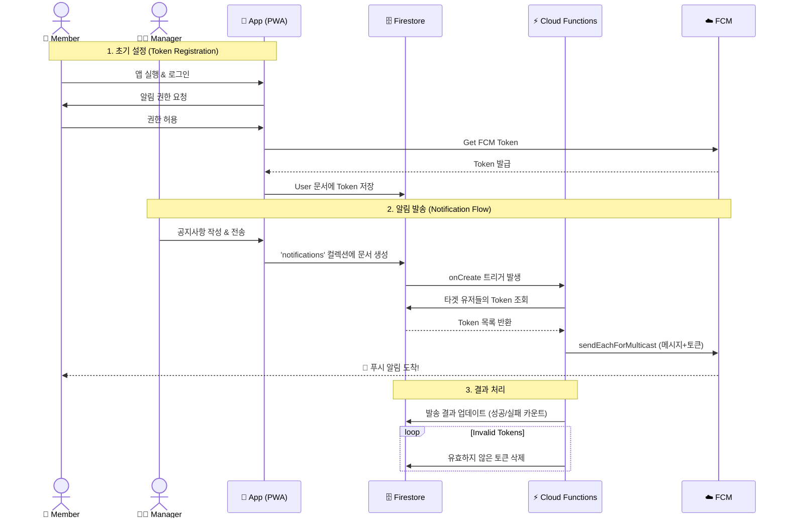

# BandMate (밴드 메이트)

학교 밴드 동아리의 효율적인 운영과 부원들의 참여 독려를 위해 제작된 **PWA(Progressive Web App)** 기반 밴드 관리 애플리케이션입니다. 

React와 Firebase를 활용하여 개발되었으며, 특히 **FCM(Firebase Cloud Messaging)** 을 이용한 강력한 푸시 알림 기능을 통해 공지사항 전달의 효율성을 극대화했습니다.

## ✨ 주요 기능 (Key Features)

### 1. 📢 푸시 알림 (Core Feature)
매니저는 전체 부원에게 즉각적인 공지사항을 전송할 수 있습니다.
- **FCM 연동:** Firebase Cloud Functions와 Messaging을 연동하여 백그라운드에서도 알림을 수신합니다.
- **크로스 플랫폼 지원:** Android 및 iOS(16.4+ PWA) 환경에서의 푸시 알림을 완벽하게 지원합니다.
- **스마트 토큰 관리:** 유효하지 않은 토큰을 자동으로 정리하여 발송 실패를 최소화합니다.

### 2. 📱 PWA (Progressive Web App)
앱 스토어 배포 없이도 네이티브 앱과 유사한 사용자 경험을 제공합니다.
- **설치형 앱:** '홈 화면에 추가' 기능을 통해 모바일 기기에 앱처럼 설치하여 사용할 수 있습니다.
- **오프라인 지원:** Workbox를 활용한 캐싱 전략으로 네트워크가 불안정한 환경에서도 로딩 속도를 최적화했습니다.

### 3. 👥 역할 기반 권한 관리 (RBAC)
사용자의 역할(Manager/Member)에 따라 접근 가능한 기능이 구분됩니다.
- **매니저 (Manager):** 공지사항 발송, 일정 등록 및 관리 권한 보유.
- **멤버 (Member):** 나의 정보 조회, 일정 확인, 알림 수신 가능.

### 4. 📅 일정 관리
- 밴드 연습, 공연 등 주요 일정을 캘린더 형태로 한눈에 확인할 수 있습니다.

## 🛠 기술 스택 (Tech Stack)

### Frontend
- **Framework:** React 18, TypeScript
- **Build Tool:** Vite
- **PWA:** vite-plugin-pwa, Workbox
- **State Management:** React Context API (AuthContext)
- **Styling:** CSS3 (Module-based structure)

### Backend (Serverless)
- **Platform:** Firebase
- **Authentication:** Firebase Auth (Email/Password)
- **Database:** Cloud Firestore (NoSQL)
- **Server Logic:** Cloud Functions for Firebase (알림 발송 트리거)
- **Messaging:** Firebase Cloud Messaging (FCM)

## 🏗 시스템 아키텍처 (FCM Flow)

1. **토큰 등록:** 사용자가 앱에 접속하여 알림 권한을 허용하면 FCM 토큰을 발급받아 Firestore(`users` 컬렉션)에 저장합니다.
2. **알림 생성:** 매니저가 '공지사항 발송' 페이지에서 메시지를 작성하면 Firestore(`notifications` 컬렉션)에 문서가 생성됩니다.
3. **트리거 실행:** Cloud Functions(`sendPushNotification`)가 문서 생성을 감지합니다.
4. **메시지 전송:** 유효한 모든 사용자의 토큰을 조회하여 FCM 멀티캐스트로 알림을 전송합니다.
5. **결과 처리:** 전송 성공/실패 여부를 기록하고, 만료된 토큰은 자동으로 삭제합니다.



## 📂 폴더 구조 (Project Structure)

```
bandmate/
├── functions/              # Firebase Cloud Functions (백엔드 로직)
│   └── src/index.ts        # 알림 발송 트리거 코드
├── src/
│   ├── context/            # 전역 상태 관리 (인증 등)
│   ├── firebase/           # Firebase 설정 및 FCM 핸들러
│   │   ├── config.ts       # 초기화 설정
│   │   └── fcm.ts          # 토큰 관리 및 알림 권한 로직
│   ├── pages/              # 주요 페이지 컴포넌트
│   │   ├── HomePage.tsx    # 메인 대시보드
│   │   ├── SendNotificationPage.tsx # (매니저용) 알림 발송
│   │   └── ...
│   ├── types/              # TypeScript 타입 정의
│   ├── App.tsx             # 라우팅 설정
│   └── sw.ts               # Service Worker 설정
├── public/
│   └── firebase-messaging-sw.js # 백그라운드 메시지 처리를 위한 SW
└── vite.config.ts          # Vite 및 PWA 플러그인 설정
```

## 🚀 설치 및 실행 (Setup)

### 1. 환경 변수 설정
프로젝트 루트에 `.env` 파일을 생성하고 Firebase 설정을 입력합니다.
(보안을 위해 `.env`는 git에 포함되지 않습니다)

```env
VITE_FIREBASE_API_KEY=your_api_key
VITE_FIREBASE_AUTH_DOMAIN=your_project.firebaseapp.com
VITE_FIREBASE_PROJECT_ID=your_project_id
VITE_FIREBASE_STORAGE_BUCKET=your_bucket
VITE_FIREBASE_MESSAGING_SENDER_ID=your_sender_id
VITE_FIREBASE_APP_ID=your_app_id
VITE_FIREBASE_VAPID_KEY=your_vapid_key
```

### 2. 패키지 설치
```bash
npm install
```

### 3. 개발 서버 실행
```bash
npm run dev
```

### 4. Cloud Functions 배포 (옵션)
백엔드 로직을 수정했다면 함수를 배포해야 합니다.
```bash
cd functions
npm install
npm run deploy
```

## 🔒 보안 (Security)
- **환경 변수 보호:** 모든 민감한 API 키와 설정값은 `.env` 파일을 통해 관리되며, 저장소에 업로드되지 않도록 `.gitignore` 처리되었습니다.
- **접근 제어:** Firestore Security Rules와 Client-side 라우팅 보호(`PrivateRoute`)를 통해 비인가 사용자의 접근을 차단합니다.

---

# 📣 [Service Introduction] 우리 밴드의 완벽한 파트너, BandMate를 소개합니다!

> **"연습 일정 잡느라 단톡방 올렸다 내렸다... 지치셨나요?"**
> **"중요한 공연 공지, 다른 톡에 밀려 못 본 부원이 있다구요?"**

이제 **BandMate**로 우리 밴드의 운영 퀄리티를 업그레이드하세요! 🚀

## 🌟 Why BandMate?

### 1️⃣ "공지사항, 이제는 '꽂힙니다'!" 📌
단톡방 공지, 누가 읽었는지 모르겠다구요?
BandMate의 **강력한 푸시 알림**은 부원들의 잠금 화면에 직접 배달됩니다.

### 2️⃣ "복잡한 설치? NO! 웹에서 바로 시작!" 🌐
앱 스토어 검색하고, 비밀번호 입력하고... 귀찮으셨죠?
BandMate는 **PWA(Progressive Web App)** 기술로, 링크 클릭 한 번으로 설치가 끝납니다.
아이폰, 갤럭시, 태블릿, PC 어디서든 **홈 화면에 추가**만 하세요. 네이티브 앱처럼 빠르고 부드럽게 작동합니다.

### 3️⃣ "우리만의 캘린더로 연습 집중력 UP!" 📅
합주, 공연, 뒤풀이까지! 밴드의 모든 일정을 한눈에 관리하세요.
---

### 🎼 밴드 운영의 새로운 리듬, BandMate
**지금 바로 우리 밴드에 도입해보세요. 매니저의 스트레스는 줄고, 합주의 퀄리티는 올라갑니다!**
